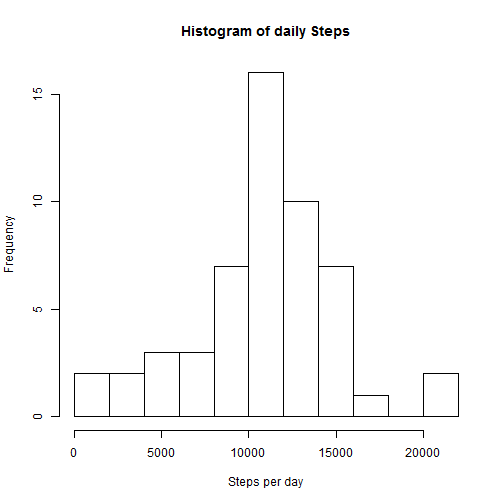
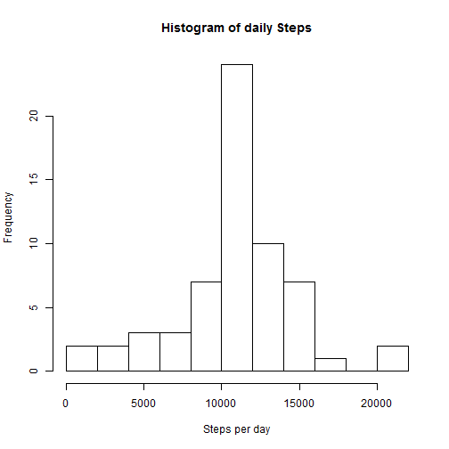
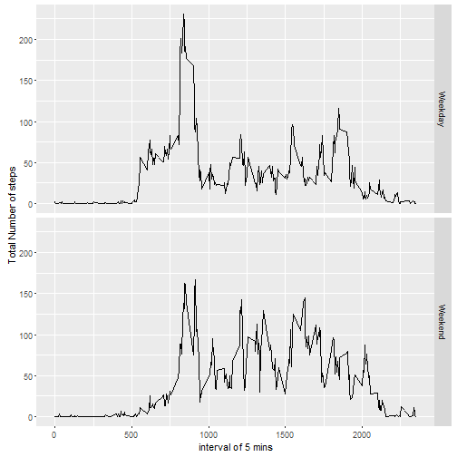

#Reproducable Reserach-Week2 Project

##Loading and preprocessing the data


```r
# setting download url path

downloadPath <- "https://d396qusza40orc.cloudfront.net/repdata%2Fdata%2Factivity.zip"

# Downloading the required data
download.file(downloadPath,destfile="./eproducableResearchWeek2/Dataset.zip")
# the data should be unzipped in the created directory
unzip(zipfile="./eproducableResearchWeek2/Dataset.zip",exdir="./eproducableResearchWeek2")

# reading existing files in unzipped folder and storing them into data tables
# setting path of the unzipped files
Path <- "C:/Users/hamed/Desktop/Data Science/Working Directory/eproducableResearchWeek2"
# Read files of subjects
file <- read.csv("./eproducableResearchWeek2/activity.csv",sep=",")
```
## What is mean total number of steps taken per day?

```r
#filtering data for specified dates
use <- !is.na(file[, "steps"])  ## Find non-missing values
newfile <- file[use,]
stepsperday <- aggregate(steps ~ date, newfile, sum)
```
###Histogramhistogram of the total number of steps taken each day


```r
hist(stepsperday$steps,main="Histogram of daily Steps",breaks=10, xlab="Steps per day", ylab ="Frequency")
```



###mean and median of the total number of steps taken per day

```r
mean(stepsperday$steps)
```

```
## [1] 10766.19
```

```r
median(stepsperday$steps)
```

```
## [1] 10765
```

##What is the average daily activity pattern?

```r
library(ggplot2)
averagesteps <- aggregate(steps ~ interval, newfile, FUN="mean")
ggplot(data=averagesteps, aes(x=interval, y=steps)) +
    geom_line() +
    xlab("5-minute interval") +
    ylab("average number of steps taken")
```


###On average across all the days in the dataset, the 5-minute interval contains the maximum number of steps?

```r
averagesteps[which.max(averagesteps$steps),]
```

```
##     interval    steps
## 104      835 206.1698
```

##Imputing missing values
###Calculate and report the total number of missing values in the dataset (i.e. the total number of rows with NAs)

```r
missingvalues <- is.na(file[, "steps"])  ## Find missing values
sum(as.numeric(missingvalues))
```

```
## [1] 2304
```
### applying a strategy for filling missing values
Strategy=replace the missing value with its corresponding average among all days for the interval

```r
fillingStrategy <- function(steps, interval) 
    {
        fillingvalue <- NA
        if (!is.na(steps))
                fillingvalue <- c(steps)
        else
                fillingvalue <- (averagesteps[averagesteps$interval==interval, "steps"])
        return(fillingvalue)
    }
completefile <- file
completefile$steps <- mapply(fillingStrategy, completefile$steps, completefile$interval)

newstepsperday <- aggregate(steps ~ date, completefile, sum)
```
###Histogramhistogram of the total number of steps taken each day


```r
hist(newstepsperday$steps,main="Histogram of daily Steps",breaks=10, xlab="Steps per day", ylab ="Frequency")
```



###mean and median of the total number of steps taken per day

```r
mean(newstepsperday$steps)
```

```
## [1] 10766.19
```

```r
median(newstepsperday$steps)
```

```
## [1] 10766.19
```

##Are there differences in activity patterns between weekdays and weekends?
###Create a new factor variable in the dataset with two levels ??? ???weekday??? and ???weekend??? indicating whether a given date is a weekday or weekend day.

```r
completefile<-transform(completefile,weekday=weekdays(as.Date(completefile$date)))
daytype<-function(weekday)
{
    if (weekday=="Saturday" | weekday=="Sunday")
        daytype="Weekend"
    else
        daytype="Weekday"
    return(daytype)
}
completefile$daytype <- mapply(daytype, completefile$weekday)
newaveragesteps <- aggregate(steps ~ interval + daytype, data=completefile, FUN="mean")
ggplot(newaveragesteps, aes(interval, steps)) + geom_line() + facet_grid(daytype ~ .) +
        xlab("interval of 5 mins") + ylab("Total Number of steps")
```


